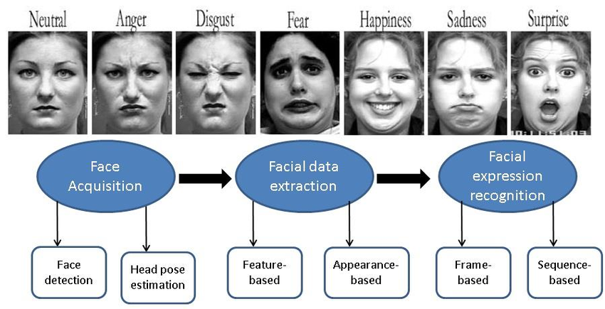

# Face-Emotional-Analysis

This repository contains a Python project that can be used to detect facial emotions. The project uses the MediaPipe face mesh API to detect face landmarks, and a simple multilayer perceptron to recognize facial emotions from the detected landmarks.

<!-- GETTING STARTED -->
## Getting Started

This repository is condisered asone of the top computer vision projects that can be used to analysis facial emotions. The project uses the mediapipe tool, which is a publicly available tool of facial analysis. The project also uses the Keras deep learning library to train a convolutional neural network (CNN) model to detect facial emotions.

### This repository contains the following contents

- Simple Python programs
- Facial emotion recognition machine learning model(TFLite)
- Script for collect data from images dataset and camera

# Prerequisites

- python
- mediapipe
- OpenCV
- Tensorflow
- scikit-learn
- matplotlib

## Installation


1. Clone the repo
   ```sh
   git clone https://github.com/bodiwael/Face-Emotion-Analysis
   ```   
2. Jump into the project folder
   ```sh
   cd Face-Emotion-Analysis
   ```   
3. install the requirements.txt
   ```sh
   pip3 install -r requirements.txt
   ```  
4. Run & Test the project
   ```sh
   python3 main.py
   ```

<!-- LICENSE -->
## License

Distributed under the MIT License. See `LICENSE.txt` for more information.

<p align="right">(<a href="#readme-top">back to top</a>)</p>


<!-- CONTACT -->
## Contact

Abdelrhaman Wael Ammar - https://www.linkedin.com/in/abdelrahman-wael-ammar/

Project Link: https://github.com/bodiwael/Face-Emotion-Analysis

<p align="right">(<a href="#readme-top">back to top</a>)</p>
